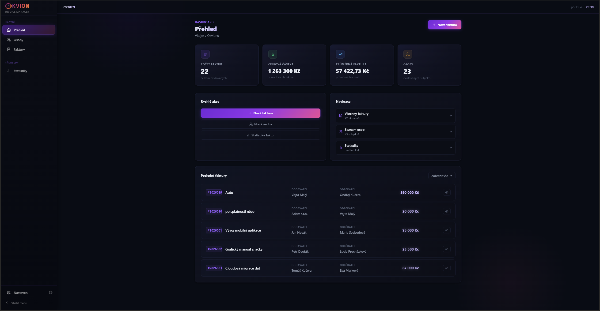
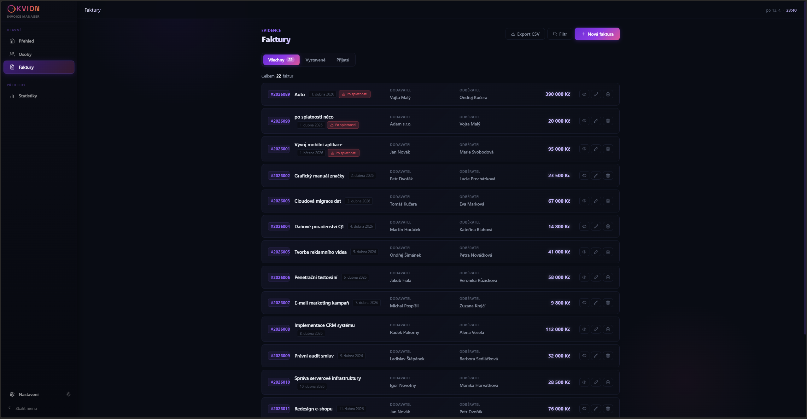
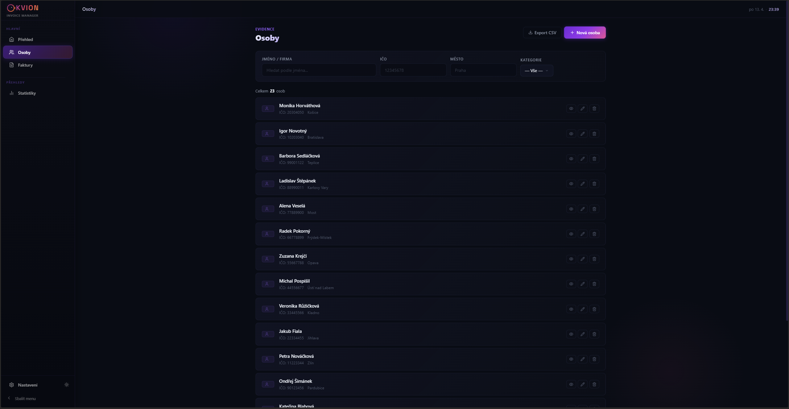
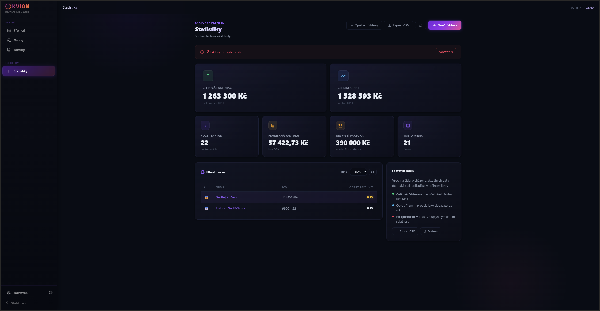
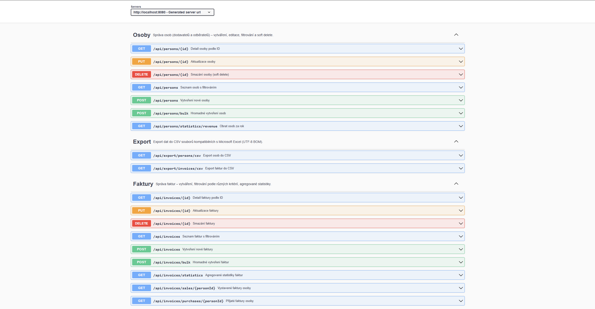

# 🟣 Okvion — Fakturační aplikace


> **Fullstack fakturační aplikace** — Spring Boot REST API · React SPA · vlastní design systém · dark/light mode · URL-driven filtry · Swagger UI

---

## 🇬🇧 English summary

**Okvion** is a fullstack invoicing web application built with Spring Boot (Java 17) and React 18. It covers the full invoicing workflow — managing business contacts, creating invoices, tracking overdue payments, and aggregated statistics. The backend follows a strict layered architecture (Controller → Service → Repository) with DTO mapping via MapStruct, class-level `@Transactional` boundaries, a unified exception handler, and auto-generated OpenAPI documentation. The frontend is a single-page React app with its own design system, URL-synced filters (shareable links), optimistic updates, and custom form components — all without a UI framework.

---

## 📑 Obsah

- [O projektu](#-o-projektu)
- [Ukázka](#-ukázka)
- [Hlavní funkce](#-hlavní-funkce)
- [Architektura](#-architektura)
- [Použité technologie](#️-použité-technologie)
- [Spuštění projektu](#-spuštění-projektu)
- [API dokumentace (Swagger UI)](#-api-dokumentace-swagger-ui)
- [Validace a error handling](#-validace-a-error-handling)
- [UX vylepšení](#-ux-vylepšení)
- [Testování](#-testování)
- [Project Highlights](#-project-highlights)
- [Roadmap](#-roadmap)
- [Poznámky k dev setupu](#-poznámky-k-dev-setupu)
- [Autor](#-autor)

---

## 💡 O projektu

**Okvion** je fullstack webová aplikace pro evidenci faktur a obchodních kontaktů. Pokrývá celý fakturační proces — od registrace osoby či firmy přes vytváření faktur, sledování splatnosti až po přehledné statistiky a správu smluvních stran.

Vznikla jako portfoliový projekt v rámci kurzu **JAVA PRO developer** na [ITnetwork.cz](https://www.itnetwork.cz). Nad rámec zadání kurzu byl projekt výrazně rozšířen o vlastní design systém, pokročilý error handling, URL-driven filtrování, OpenAPI dokumentaci, UX komponenty a testování.

---

## 🖼 Ukázka

### Dashboard


### Seznam faktur s filtrováním


### Správa osob


### Statistiky s upozorněním na faktury po splatnosti


### Swagger UI — auto-generovaná API dokumentace


---

## ✨ Hlavní funkce

### 👤 Správa osob
- Plný CRUD — vytvoření, úprava, soft delete, detail
- Eviduje jméno / firmu, IČO, DIČ, bankovní spojení, kontakt, adresu, kategorii (IT / Marketing / Zboží / Vozidla / Ostatní)
- Vyhledávání podle jména, IČO, města a kategorie
- Stránkování — 10 / 25 / 50 / 100 položek na stránku
- Export do CSV (UTF-8 BOM, kompatibilní s Excelem)
- Přehled vystavených a přijatých faktur přímo z detailu osoby

### 🧾 Správa faktur
- Plný CRUD — vytvoření, úprava, smazání, detail
- Přiřazení dodavatele a odběratele z evidence osob
- Automatický výpočet ceny s DPH
- Badge „Po splatnosti" — vizuální upozornění při prošlém datu splatnosti
- **Pokročilé filtrování** — produkt, rozsah cen, datum vystavení (od/do), datum splatnosti (od/do), přepínač „pouze po splatnosti"
- **URL-driven filtry** — stav filtrování se ukládá do URL query params (sdílitelné odkazy, zpětné tlačítko zachovává filtr, refresh stránky nic nezahodí)
- Přepínání pohledů: Všechny / Vystavené / Přijaté s výběrem osoby
- Fulltext search napříč sloupci tabulky
- Export do CSV (respektuje aktivní filtry)

### 📊 Statistiky
- Celkový počet faktur, součet bez DPH, součet s DPH, průměrná hodnota
- Nejvyšší faktura, počet faktur za aktuální měsíc, počet faktur po splatnosti
- Obrat firem (jako prodávajících) za zvolený rok
- Data se počítají přímo na backendu pomocí JPQL agregačních dotazů
- Klikací banner „Faktury po splatnosti" vede na předfiltrovaný seznam

### 🎨 UI / UX
- Dark mode (výchozí) a Light mode — persistováno v `localStorage`
- Sbalitelný sidebar na desktopu
- Skeleton loading místo spinneru při načítání dat
- Vlastní toast notifikace (success / error / loading) v pravém dolním rohu
- Optimistic updates pro mazání — okamžitá reakce UI s rollbackem při chybě
- Vlastní `ConfirmModal` — žádné `window.confirm` ani `alert` v celé aplikaci
- Datum a čas v topbaru s volitelným formátem
- Nastavení aplikace: téma, jazyk, formát data a formát času

---

## 🏗 Architektura

### Vrstvená architektura backendu

```
HTTP Request
    ↓
Controller          ← @Valid Bean Validation, @RequestBody, @Operation (OpenAPI)
    ↓
Service             ← @Transactional, business validace (BusinessException)
    ↓
Repository          ← JPA Specification, JPQL agregační dotazy
    ↓
Entity / MySQL
    ↓
DTO + MapStruct     ← Entity → DTO před odesláním do controlleru
    ↓
HTTP Response       ← ErrorResponseDTO při chybě
```

### Klíčové patterny

- **Constructor injection** — žádné `@Autowired` na fieldech, konstruktor přes `final` pole
- **DTO pattern** — JPA entity nikdy neprocházejí přes HTTP vrstvu
- **MapStruct mapping** — mapování Entity ↔ DTO bez boilerplate
- **Class-level `@Transactional`** — všechny service třídy deklarativně transakční, read metody označené `readOnly = true` jako Hibernate hint
- **Soft delete** — osoby se nemažou fyzicky, ale označí se `hidden = true`, aby zůstala zachována historie faktur
- **Centralizovaný exception handler** — `@RestControllerAdvice` s 6 specializovanými handlery + fallback
- **JPA Specification** — dynamické filtrování bez pevně napsaných JPQL dotazů
- **Auto-generovaná API dokumentace** — Springdoc OpenAPI + Swagger UI

### Struktura projektu

```
invoice-app/
├── backend/                          # Spring Boot aplikace
│   └── src/main/java/cz/itnetwork/
│       ├── controller/               # REST controllery (Person, Invoice, Export)
│       │   └── advice/               # GlobalExceptionHandler
│       ├── service/                  # Business logika (rozhraní + Impl)
│       ├── entity/                   # JPA entity
│       │   └── repository/           # Spring Data repozitáře + JPA Specification
│       ├── dto/                      # Data Transfer Objects
│       │   └── mapper/               # MapStruct mappery (Entity ↔ DTO)
│       ├── exception/                # BusinessException
│       ├── configuration/            # CORS, Spring config
│       └── constant/                 # Countries, PersonCategory
│
└── frontend/                         # React SPA
    └── src/
        ├── pages/                    # HomePage, SettingsPage
        ├── invoices/                 # InvoiceIndex, Detail, Form, Table, Statistics
        ├── persons/                  # PersonIndex, Detail, Form, Table, constants
        ├── components/               # Sdílené komponenty
        │   ├── ToastContext.jsx      #   Toast systém (Context + Provider)
        │   ├── PersonSelect.jsx      #   Vyhledávací dropdown pro výběr osoby
        │   ├── CountrySelect.jsx     #   Vyhledávací dropdown pro výběr země
        │   ├── DateInput.jsx         #   Custom date picker s kalendářem
        │   ├── CustomSelect.jsx      #   Generický styled dropdown
        │   ├── SkeletonList.jsx      #   Skeleton loading komponenta
        │   ├── ConfirmModal.jsx      #   Potvrzovací modal s focus managementem
        │   ├── Pagination.jsx        #   Stránkování
        │   └── usePagination.js      #   Custom React hook
        ├── layout/                   # Sidebar, TopBar, AppRoutes
        ├── utils/
        │   ├── api.js                #   Fetch wrapper s ErrorResponseDTO
        │   ├── appSettings.js        #   Settings manager (localStorage)
        │   ├── dateUtils.js          #   Konverze a validace datumů
        │   └── formatCurrency.js     #   Formátování částek
        └── index.css                 #   Design systém (CSS proměnné)
```

---

## 🛠️ Použité technologie

### Backend

| Technologie | Verze | Použití |
|---|---|---|
| Java | 17 | Programovací jazyk |
| Spring Boot | 3.1 | Aplikační framework, auto-konfigurace |
| Spring Data JPA + Hibernate | — | ORM, DDL auto, lazy loading |
| JPA Specification | — | Dynamické filtrování faktur |
| MapStruct | 1.5 | Mapování Entity ↔ DTO |
| Lombok | 1.18 | Generování getterů, setterů |
| Bean Validation | — | `@NotNull`, `@NotBlank`, `@Positive`, `@Email` |
| Springdoc OpenAPI | 2.2 | Swagger UI na `/swagger-ui.html` |
| JUnit 5 + Mockito | — | Unit testy service vrstvy |
| H2 (test scope) | — | In-memory DB pro integrační testy |
| Maven | — | Build a správa závislostí |

### Frontend

| Technologie | Verze | Použití |
|---|---|---|
| React | 18 | UI framework, SPA |
| React Router | 6 | Klientské routování, `useSearchParams` pro URL filtry |
| Lucide React | 0.383 | Ikony |
| Vite | 6 | Build tool, dev server |
| Vitest + Testing Library | — | Unit testy komponent |
| CSS Custom Properties | — | Vlastní design systém, dark/light mode |
| ESLint (flat config) | 9 | Lint s React plugins |

### Databáze a nástroje

| Nástroj | Použití |
|---|---|
| MySQL 8 (XAMPP) | Relační databáze — tabulky generuje Hibernate |
| Git / GitHub | Verzování, iterativní vývoj |
| IntelliJ IDEA | IDE pro backend |
| VS Code | IDE pro frontend |

---

## 🚀 Spuštění projektu

### Požadavky

- **Java 17+** (`java -version` pro ověření)
- **Node.js 18+** (`node -v`)
- **MySQL** — doporučeno přes [XAMPP](https://www.apachefriends.org/)
- **Maven** (volitelně — projekt obsahuje `mvnw` wrapper)

### 1. Klonování repozitáře

```bash
git clone https://github.com/ondrekucera/invoice-app.git
cd invoice-app
```

### 2. Databáze

1. Spusť **XAMPP Control Panel** → nastartuj **MySQL**
2. Databáze `invoice_app` se vytvoří automaticky při prvním spuštění backendu (díky `createDatabaseIfNotExist=true` v connection stringu)
3. Tabulky generuje Hibernate (`ddl-auto: update`)
4. Žádné SQL skripty ani migrace nejsou potřeba

**Pokud máš v XAMPP nastavené heslo pro root** (nebo používáš MySQL mimo XAMPP), uprav `backend/src/main/resources/application.yaml`:

```yaml
spring:
  datasource:
    url: jdbc:mysql://localhost:3306/invoice_app?createDatabaseIfNotExist=true
    username: root
    password: TVOJE_HESLO
```

### 3. Backend

```bash
cd backend
./mvnw spring-boot:run
```

Backend naběhne na **`http://localhost:8080`** a automaticky vytvoří tabulky v MySQL.

### 4. Frontend

```bash
cd frontend
npm install
npm run dev
```

Frontend běží na **`http://localhost:3000`** a připojuje se k backendu přes proměnnou `VITE_API_URL` (viz `frontend/.env`).

> ⚠️ Backend musí být spuštěný dřív než frontend, jinak první API volání selže.

### 5. Otevření aplikace

- **Aplikace:** http://localhost:3000
- **Swagger UI:** http://localhost:8080/swagger-ui.html
- **OpenAPI JSON:** http://localhost:8080/api-docs

### Spuštění testů

```bash
# Backend unit testy (JUnit 5 + Mockito)
cd backend
./mvnw test

# Frontend unit testy (Vitest + Testing Library)
cd frontend
npm run test
```

---

## 📖 API dokumentace (Swagger UI)

Celé REST API je auto-dokumentováno pomocí **Springdoc OpenAPI** a dostupné přes interaktivní **Swagger UI**:

**http://localhost:8080/swagger-ui.html**

Všechny endpointy jsou otagované a popsané v češtině — `@Tag` na controllerech, `@Operation` na každé metodě. V Swagger UI lze endpointy přímo testovat bez nutnosti Postmanu.

### Přehled endpointů

#### 👤 Osoby

| Metoda | Endpoint | Popis |
|---|---|---|
| `GET` | `/api/persons` | Seznam osob s filtrováním (name, ičo, city, country, category) |
| `GET` | `/api/persons/{id}` | Detail osoby |
| `POST` | `/api/persons` | Vytvoření osoby |
| `POST` | `/api/persons/bulk` | Hromadné vytvoření osob |
| `PUT` | `/api/persons/{id}` | Úprava osoby |
| `DELETE` | `/api/persons/{id}` | Soft delete (hidden = true) |
| `GET` | `/api/persons/statistics/revenue` | Obrat osob za rok |

#### 🧾 Faktury

| Metoda | Endpoint | Popis |
|---|---|---|
| `GET` | `/api/invoices` | Seznam faktur s filtrováním (product, cena, data, overdue, limit) |
| `GET` | `/api/invoices/{id}` | Detail faktury |
| `POST` | `/api/invoices` | Vytvoření faktury |
| `POST` | `/api/invoices/bulk` | Hromadné vytvoření faktur |
| `PUT` | `/api/invoices/{id}` | Úprava faktury |
| `DELETE` | `/api/invoices/{id}` | Smazání faktury |
| `GET` | `/api/invoices/statistics` | Agregované statistiky |
| `GET` | `/api/invoices/sales/{personId}` | Vystavené faktury osoby |
| `GET` | `/api/invoices/purchases/{personId}` | Přijaté faktury osoby |

#### 📦 Export

| Metoda | Endpoint | Popis |
|---|---|---|
| `GET` | `/api/export/persons/csv` | Export osob do CSV (UTF-8 BOM) |
| `GET` | `/api/export/invoices/csv` | Export faktur do CSV (respektuje filtry) |

### Struktura chybové odpovědi

Všechny chyby používají jednotnou strukturu `ErrorResponseDTO`:

```json
{
  "timestamp": "2026-03-28T14:30:00",
  "status": 400,
  "error": "Bad Request",
  "message": "Vstupní data obsahují chyby.",
  "path": "/api/invoices",
  "validationErrors": {
    "product": "Produkt nesmí být prázdný.",
    "issued": "Datum vystavení je povinné."
  }
}
```

---

## 🛡️ Validace a error handling

### Bean Validation (HTTP 400)

- `PersonDTO`: `@NotBlank` na jméno a IČO, `@Email` na e-mail, `@Size` na stringy
- `InvoiceDTO`: `@NotNull` na datum a smluvní strany, `@Positive` na číslo faktury, `@DecimalMin("0.0")` na cenu a DPH
- Aktivováno přes `@Valid` na POST a PUT endpointech

### Business validace (HTTP 422)

- Kupující a prodávající nesmí být stejná osoba
- Datum splatnosti nesmí být před datem vystavení
- Cena ani DPH nesmí být záporné
- Null-safety kontroly pro buyer/seller ID
- Implementováno v `InvoiceServiceImpl.validateInvoiceBusinessRules()` přes `BusinessException`

### Centralizovaný exception handler

`GlobalExceptionHandler` (`@RestControllerAdvice`) zachycuje 6 typů výjimek a převádí je na konzistentní `ErrorResponseDTO`:

| Výjimka | HTTP status | Použití |
|---|---|---|
| `EntityNotFoundException` | `404 Not Found` | Osoba / faktura neexistuje |
| `MethodArgumentNotValidException` | `400 Bad Request` | Bean Validation selhala — vrací mapu `pole → zpráva` |
| `HttpMessageNotReadableException` | `400 Bad Request` | Nevalidní JSON nebo špatný datový typ |
| `BusinessException` | `422 Unprocessable Entity` | Porušení business pravidel |
| `DataIntegrityViolationException` | `409 Conflict` | Porušení DB constraintu (např. duplicitní IČO) — rozpoznává unique violation a vrací srozumitelnou hlášku |
| `Exception` (fallback) | `500 Internal Server Error` | Cokoli neočekávaného — loguje stacktrace přes SLF4J, uživateli vrací obecnou hlášku bez detailů |

### Frontend error handling

- `api.js` parsuje `ErrorResponseDTO` z každé chybové odpovědi
- `parseApiError(error)` vrátí `{ message, validationErrors }` pro použití ve formulářích
- Validační chyby se zobrazují inline pod příslušnými poli
- Při chybě formulář scrolluje na první chybné pole, zavolá `focus()` a spustí pulse animaci
- `noValidate` atribut na formulářích — žádná browser-level validace

---

## 💎 UX vylepšení

### URL-driven filtry

Stav filtrování v seznamu faktur je synchronizovaný s URL query parametry přes `useSearchParams` z React Routeru. Díky tomu:

- **Sdílitelné odkazy** — `/invoices?overdue=true&minPrice=10000` lze poslat kolegovi a uvidí stejný pohled
- **Zpětné tlačítko prohlížeče** vrací předchozí stav filtrů
- **Refresh stránky** zachovává filtrování
- **Deep linking ze statistik** — klik na banner "Faktury po splatnosti" vede přímo na předfiltrovaný seznam

### Toast notifikace

- Vlastní toast systém bez externí knihovny — React Context + Provider
- Typy: `success` (zelený), `error` (červený), `info` (modrý), `loading` (fialový se spinnerem)
- `loading` toast se nezavírá automaticky — přechází na `success` / `error` po odpovědi backendu
- `updateToast(id, patch)` umožňuje aktualizovat existující toast
- Animace fade-in / fade-out pomocí CSS keyframes
- Pozice: pravý dolní roh, stackování více toastů

### Optimistic updates

- Mazání faktur a osob: položka zmizí z UI okamžitě bez čekání na server
- Při selhání API požadavku se položka vrátí zpět (rollback)
- Chyba je zobrazena přes error toast

### Skeleton loading

- Místo spinneru se zobrazí skeleton řádky imitující skutečný layout
- Shimmer animace pomocí CSS gradient + keyframes
- Přizpůsobeno dark / light modu přes CSS proměnné

### Custom formulářové komponenty

- **`PersonSelect`** — vyhledávací dropdown pro výběr osoby, debounce 300 ms, inline vytvoření nové osoby
- **`CountrySelect`** — vyhledávací dropdown pro výběr země (CZ / SK)
- **`DateInput`** — textový input s custom kalendářem, podporuje CZ (DD.MM.YYYY) i ISO formát, validuje reálná data
- **`CustomSelect`** — generický styled dropdown (nahrazuje `<select>`)
- Všechny custom selecty zavírají dropdown po výběru i kliknutím mimo

### Nastavení aplikace

- Téma (tmavé / světlé)
- Jazyk (čeština / angličtina)
- Formát datumu (DD.MM.YYYY / YYYY-MM-DD)
- Formát času (24h / 12h)
- Vše persistováno v `localStorage`

---

## 🧪 Testování

### Backend (JUnit 5 + Mockito)

**`InvoiceServiceImplTest`** — 7 unit testů:
- Throws při `null` buyer / seller
- Throws při `null` buyer.id / seller.id
- Throws když buyer == seller
- Throws když dueDate je před issued
- Throws při záporné ceně / DPH

**`PersonServiceImplTest`** — 5 unit testů:
- `getAll` vrací pouze viditelné osoby
- `removePerson` nastaví `hidden = true` (soft-delete)
- `removePerson` tiše selže pokud osoba neexistuje
- `getPersonById` vyhodí `EntityNotFoundException`
- `addPerson` uloží a vrátí DTO

### Frontend (Vitest + Testing Library)

**`PersonSelect.test.jsx`** — 5 testů:
- Zobrazí placeholder při prázdné hodnotě
- Zobrazí jméno vybrané osoby
- Otevře dropdown po kliknutí
- Zobrazí možnost „Vytvořit novou osobu"
- Zavolá `onChange` po výběru osoby

---

## 🏆 Project Highlights

### Architektura
- Striktní vrstvená architektura bez přeskakování vrstev
- **Class-level `@Transactional`** — deklarativní transakční hranice, read metody s `readOnly = true` jako hint pro Hibernate
- DTO pattern s MapStruct — JPA entity nikdy neprocházejí přes HTTP vrstvu
- `BusinessException` odlišena od technických výjimek — různé HTTP statusy (422 vs 500)
- `ErrorResponseDTO` se sjednocenou strukturou pro všechny typy chyb
- **6 specializovaných exception handlerů + fallback** — žádná neošetřená výjimka

### Reusable komponenty
- `usePagination` hook — stránkování s automatickou korekcí stránky po smazání záznamu
- `ToastContext` — globální toast systém dostupný v celé aplikaci přes React Context
- `ConfirmModal` — generický potvrzovací dialog s Escape klávesou, focus managementem a overlay
- Custom selecty (`PersonSelect`, `CountrySelect`, `DateInput`) — konzistentní design, bez UI knihovny

### Validace
- Dvouúrovňová validace: Bean Validation (400) + business logika (422)
- Frontend parsuje `validationErrors` mapu a zobrazuje zprávy inline u polí
- Scroll + focus + pulse animace na první chybné pole při submit

### UX přístup
- Žádný `window.confirm`, `alert()` ani browser popup — vše řeší vlastní komponenty
- Toast progress: loading → success/error při každé mutační operaci
- Optimistic updates zachovávají plynulost UI, rollback chrání integritu dat
- Debounce vyhledávání v PersonSelect — filtr se spustí až po 300 ms pauze

### Čistota řešení
- Konzistentní kódový styl a pojmenování napříč backendem i frontendem
- CSS design systém postavený výhradně na CSS Custom Properties — bez CSS frameworku
- Skeleton loading respektuje skutečný layout — žádné generické loadery
- Všechny komentáře v kódu jsou česky, stručné a vysvětlují „proč", ne „co"
- **0 ESLint errors** (jen jeden záměrně ponechaný warning)

---

## 🎯 Roadmap

Projekt je živý a plánuju pokračovat v rozšiřování. Následující body ukazují, kam se bude vyvíjet dál — zároveň reflektují produkční realitu, které si jsem vědom, ale která nebyla součástí zadání kurzu:

- [ ] **Spring Security + JWT autentizace** — login, registrace, role-based access
- [ ] **Multi-tenancy** — každý uživatel vidí pouze svoje osoby a faktury
- [ ] **Optimistic locking** (`@Version`) — ochrana proti tichým přepisům při konkurentní editaci
- [ ] **Flyway migrace** — nahradí `ddl-auto: update` kontrolovanými SQL skripty pro produkci
- [ ] **PDF generování faktur** — export do PDF přes iText / OpenPDF
- [ ] **ISDOC import/export** — podpora českého standardu pro elektronické faktury
- [ ] **Docker deploy** — Dockerfile + docker-compose pro jednoduchý deployment
- [ ] **CI/CD pipeline** — GitHub Actions (build, test, lint na každý push)
- [ ] **Migrace frontendu na TypeScript** — typová bezpečnost napříč komponenty a API vrstvou

---

## 📝 Poznámky k dev setupu

Tento projekt je aktuálně optimalizovaný pro **lokální vývoj a prezentaci**, ne pro produkční nasazení. Několik vědomých zjednodušení:

- **`ddl-auto: update`** — Hibernate automaticky vytváří a aktualizuje schéma. Pro produkci plánuji přechod na Flyway (viz Roadmap).
- **XAMPP MySQL s root uživatelem bez hesla** — výchozí XAMPP konfigurace, vhodná pro dev. Pro produkci by bylo třeba vytvořit dedikovaného uživatele s omezenými právy.
- **Žádná autentizace** — aplikace je single-user demo. Spring Security je v Roadmap jako fáze 2.
- **CORS otevřený pro `localhost:3000`** — vývojová konfigurace. Produkce by měla striktnější origin whitelist.

Tyto body záměrně zmiňuji, aby bylo jasné, že si jich jsem vědom — nejsou to přehlédnutí, ale rozhodnutí odpovídající fázi projektu.

---

## 👤 Autor

**Ondřej Kučera**
📍 Brno, Česká republika

[](https://github.com/ondrekucera)
[](https://www.linkedin.com/in/ondrecreates)
[](mailto:ondrecreates@gmail.com)

> Portfoliový projekt vytvořený v rámci kurzu [**JAVA PRO developer**](https://www.itnetwork.cz) na ITnetwork.cz. Rozšířen nad rámec zadání o vlastní design systém, URL-driven filtry, OpenAPI dokumentaci a pokročilý error handling.

---

<div align="center">
  <sub>🟣 <strong>Okvion</strong> &nbsp;·&nbsp; Java 17 · Spring Boot 3.1 · React 18 · Vite 6 · MySQL · Swagger UI</sub>
</div>
